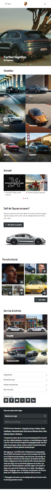
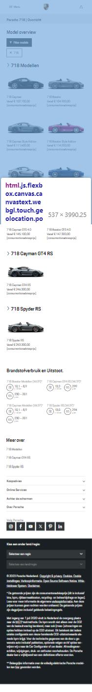
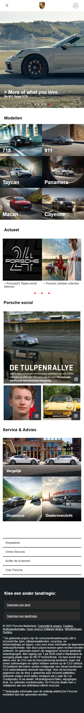
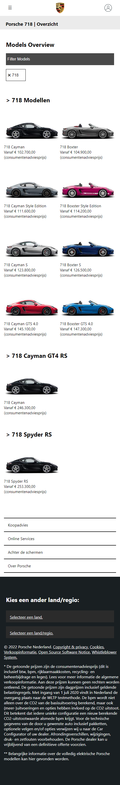

# Procesverslag
Markdown is een simpele manier om HTML te schrijven.  
Markdown cheat cheet: [Hulp bij het schrijven van Markdown](https://github.com/adam-p/markdown-here/wiki/Markdown-Cheatsheet).

Nb. De standaardstructuur en de spartaanse opmaak van de README.md zijn helemaal prima. Het gaat om de inhoud van je procesverslag. Besteedt de tijd voor pracht en praal aan je website.

Nb. Door *open* toe te voegen aan een *details* element kun je deze standaard open zetten. Fijn om dat steeds voor de relevante stuk(ken) te doen.

## Jij

  
uitwerken voor kick-off werkgroep

  ### Auteur:
  Ruben Beck

  #### Je startniveau:
  Blauw (kies uit zwart, rood óf blauw)

  #### Je focus:
 Surface plane (kies uit responsive óf surface plane)
 

## Je website

  
uitwerken voor kick-off werkgroep

  ### Je opdracht:
https://www.porsche.com/netherlands/nl/
  #### Screenshot(s) van de eerste pagina (small screen): 
  hier de naam van de pagina  
  

  #### Screenshot(s) van de tweede pagina (small screen):
  hier de naam van de pagina  
  
 

## Toegankelijkheidstest 1/2 (week 1)

  
uitwerken na test in 2e werkgroep

  ### Bevindingen
  Ik had nog erg weinig om te laten zien hier omdat ik erg druk was met adere vakken/ hers

## Breakdownschets (week 1)

  
uitwerken na afloop 3e werkgroep

  ### de hele pagina: 
  

  ### dynamisch deel (bijv menu): 
  

  ### wellicht nog een dynamisch deel (bijv filter): 
  

## Voortgang 1 (week 2)

  
uitwerken voor 1e voortgang

  ### Stand van zaken
Wat goed ging:
-html 
-begin van css

  ### Agenda voor meeting
  samen met je groepje opstellen

Ruben: Ik wou graag weten welke manieren ik kon gebruiken om mijn website responsiver te maken.
ziggy: info over svg foutmeldingen
Elisa: Persoonlijke html check
jake:-

  ### Verslag van meeting
  hier na afloop snel de uitkomsten van de meeting vastleggen

  - Flexbox gebruiken

## Voortgang 2 (week 3)

  
uitwerken voor 2e voortgang

  ### Stand van zaken
  hier dit ging goed & dit was lastig (neem ook screenshots op van delen van je website en code)

  ### Agenda voor meeting
  samen met je groepje opstellen
Ruben: Ik wil graag begrijpen hoe ik gemakkelijk en svg voor een afbeelding kan zetten, ook wil ik en ruimte tussen me afbeeldingen weghalen
Ziggy: Info svg foutmelding en info over oneindig scrollen
Leon: schalen elementen. 

  ### Verslag van meeting
  hier na afloop snel de uitkomsten van de meeting vastleggen
- De afstand kan worden weggehaald door display: block; 
- ...

## Toegankelijkheidstest 2/2 (week 4)

  
uitwerken na test in 9e werkgroep

  ### Bevindingen
  Lijst met je bevindingen die in de test naar voren kwamen (geef ook aan wat er verbeterd is):

## Voortgang 3 (week 4)

  
uitwerken voor 3e voortgang

  ### Stand van zaken
 Wat goed ging was het beter begrijpen van me css en hoe ik het kon vormgeven in de stijl van de porsche website, wat minder goed ging was et implementeren van de JS

  ### Agenda voor meeting
  Ruben: ik wil graag meer informatie over waar in mijn pagina ik het makkelijkst javascript kan toepassen
  ziggy: Hoe kan ik en image en focus geven.
  jake:-
  Elisa:-

  ### Verslag van meeting
  hier na afloop snel de uitkomsten van de meeting vastleggen

  - carosel en menu is het beste voor de javaScript

## Eindgesprek (week 5)

  
uitwerken voor eindgesprek

  ### Je uitkomst - karakteristiek screenshots:
  
  

  ### Dit ging goed/Heb ik geleerd: 
 ik heb geleerd hoe ik aspecten van en website op de juiste manier moet positioneren zodat ze responsive werken, ook heb ik geleerd hoe je bepaalde stijlen van en bestaande website kan vinden en hiervan veel kan leren. Ik heb geleerd wat betere en semantischere manieren zijn van het schrijven van code zoals het gebruiken van roots.

  

  ### Dit was lastig/Is niet gelukt:
  Wat ik erg lastig vind/vond is javascript, dit is voor mij nog een aandachtspuntje. De functies die ik hiermee wou bereiken zijn bijna gelukt, alleen het menu op de detailpagina wil niet uitklappen.

  

## Bronnenlijst

  
continu bijhouden terwijl je werkt

  Nb. Wees specifiek ('css-tricks' als bron is bijv. niet specifiek genoeg). 
  Nb. ChatGpT en andere AI horen er ook bij.
  Nb. Vermeld de bronnen ook in je code.

  1. chat GPT
  2. https://codepen.io/shooft/pen/LYqgJPO
  3. w3schools.com
  4. Bahaa Studentassistent
  5. Sander (klasgenoot)
  6. Sem (klasgenoot)

